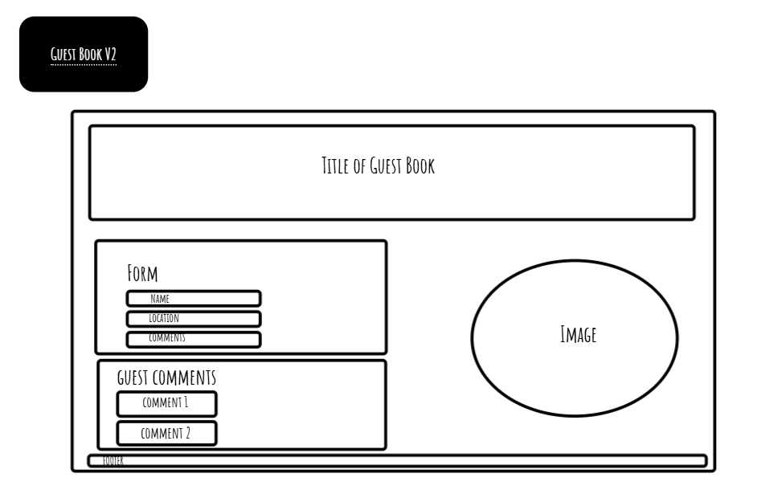

REFLECTION

GitHub:
Render:

WIREFRAME:

TRELLO:

REQUIREMENTS ACHIEVED:

REQUIREMENTS NOT ACHIEVED:

EXTERNAL SOURCES USED:
TechEd Moodle workshops

WHAT WENT REALLY WELL:

WHAT COULD HAVE GONE BETTER:
-Github and me weren't really friends at the start of this. It got better, but we're still not always on the same page. It's a complicated relationship...
