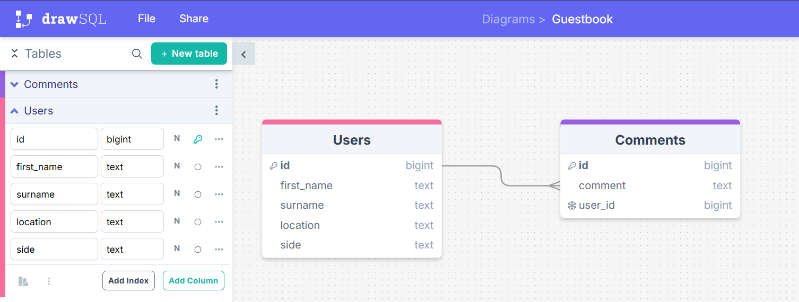

REFLECTION

GitHub:
Render:

WIREFRAME:

DRAWSQL:

TRELLO:

REQUIREMENTS ACHIEVED:
Honestly, not sure at this point. Possibly only half?

REQUIREMENTS NOT ACHIEVED:
The other half...

EXTERNAL SOURCES USED:
TechEd Moodle workshops
ChatGPT
OKSo.app
https://stackoverflow.com/questions/52787539/react-adding-event-preventdefault-method-into-functional-component

WHAT WENT REALLY WELL:
The first two hours on Thursday! I was flying with setting up the basics and creating a page with header, background image, sections, and a form. I was ready to start the gritty work. I tried to push to git, and it all started to go a little wrong. I had help from Manny and we both ended up deciding to start afresh as we couldn't work out why it wouldn't stop being pushed to Week6 assignment.

No bother, I started again afresh on Friday..

WHAT COULD HAVE GONE BETTER:
-Github and me weren't really friends at the start of this. It got better, but we're still not always on the same page. It's complicated.

- EDIT: It got better once, but then went wrong again because at 5pm Saturday I needed to revert to the 3pm commit I'd made on Git because it was so messy and tangled after 2 hours work, but it wouldn't let me! I got error after error and things never really recovered from there. It meant that for the rest of the weekend I was then working on one version of it, and couldn't commit any more. I have included some of the errors I was getting below, partly as proof that I did try(!), but partly because I wouldn't mind knowing what the problem was. Felt very alone on Sat/Sun doing this as I know no-one who codes, Google isn't always clear, and ChatGPT sends me round in circles!
  -Because of the above, Render and I weren't also friends this week. I couldn't deploy - massive apologies.

- The Github errors wasted so much time trying to resolve. As such, things like Trello and styling and other functionality went out of the window because I ran out of time.
- Things like, the header - I would want them to actually perform properly. I think they do, but only on the homepage. Not if you progress with the form, etc.
- What also could have gone better is not needing to rely on ChatGPT for help. It's partly absolutely useless because it will literally contradict itself on two answers, but at the same time, at the weekends I'm flying solo and do need some support. That said, because of the way I set up my process in the form (add user, add comment, show comment), once I had had the help from ChatGPT to show data from supabase between add user and add comment, I was then able to replicate and try on my own between add comment and show comment.

Overall, I'm proud of how far I've come since the start of this course and I LOVE when something goes right after struggling for ages, but know there's a long way to go!

Examples of GIT errors:
Worked from 2.30pm ish Saturday
3pm clean commit to Git- happy with

Between then and 5pm, something went wrong and couldn't fix it and didn't want to push to Git

Went back to it at 9pm Saturday evening

Made a git reset --hard HEAD^ as per https://www.geeksforgeeks.org/how-to-revert-to-last-commit/

Which took me back to the 3pm commit. Carried on working on that. Went to commit at 10.20pm:

➜  client git:(main) ✗ git add .
➜  client git:(main) ✗ git commit -m "Trying to connect paths between components. This version 
renders the correct component on screen, but functionality not yet working."
[main 1078ab3] Trying to connect paths between components. This version renders the correct component on screen, but functionality not yet working.
 6 files changed, 2189 insertions(+), 201 deletions(-)
➜  client git:(main) ✗ git push
To github.com:Natasha-C-creator/week7assignment.git
 ! [rejected]        main -> main (non-fast-forward)
error: failed to push some refs to 'github.com:Natasha-C-creator/week7assignment.git'
hint: Updates were rejected because the tip of your current branch is behind
hint: its remote counterpart. If you want to integrate the remote changes,
hint: use 'git pull' before pushing again.
hint: See the 'Note about fast-forwards' in 'git push --help' for details.
➜  client git:(main) ✗ git push --help
➜  client git:(main) ✗ git pull
hint: You have divergent branches and need to specify how to reconcile them.
hint: You can do so by running one of the following commands sometime before
hint: your next pull:
hint: 
hint:   git config pull.rebase false  # merge
hint:   git config pull.rebase true   # rebase
hint:   git config pull.ff only       # fast-forward only
hint: 
hint: You can replace "git config" with "git config --global" to set a default
hint: preference for all repositories. You can also pass --rebase, --no-rebase,
hint: or --ff-only on the command line to override the configured default per
hint: invocation.
fatal: Need to specify how to reconcile divergent branches.
➜  client git:(main) ✗ git checkout -b "Latest"
Switched to a new branch 'Latest'
➜  client git:(Latest) ✗ git add .
➜  client git:(Latest) ✗ git commit -m "Latest version that is working.. ish" 
On branch Latest
Changes not staged for commit:
  (use "git add <file>..." to update what will be committed)
  (use "git restore <file>..." to discard changes in working directory)
        modified:   ../server/server.js

Untracked files:
  (use "git add <file>..." to include in what will be committed)
        ../node_modules/
        ../package-lock.json
        ../package.json

no changes added to commit (use "git add" and/or "git commit -a")
➜  client git:(Latest) ✗ git add .
➜  client git:(Latest) ✗ git commit -m "Latest"
On branch Latest
Changes not staged for commit:
  (use "git add <file>..." to update what will be committed)
  (use "git restore <file>..." to discard changes in working directory)
        modified:   ../server/server.js

Untracked files:
  (use "git add <file>..." to include in what will be committed)
        ../node_modules/
        ../package-lock.json
        ../package.json

no changes added to commit (use "git add" and/or "git commit -a")
➜  client git:(Latest) ✗ git commit -a
Aborting commit due to empty commit message.
➜  client git:(Latest) ✗ 

-------------------------

➜  assignment-guestbook git:(main) ✗ git add .
➜  assignment-guestbook git:(main) ✗ git commit -m "SOMETHING WORKED. The form on the client no
w correctly adds a user to the supabase table"
[main c294444] SOMETHING WORKED. The form on the client now correctly adds a user to the supabase table
 162 files changed, 14293 insertions(+), 14 deletions(-)
 create mode 100644 node_modules/.package-lock.json
 create mode 100644 node_modules/pg-cloudflare/LICENSE
 create mode 100644 node_modules/pg-cloudflare/README.md
 create mode 100644 node_modules/pg-cloudflare/dist/empty.d.ts
 create mode 100644 node_modules/pg-cloudflare/dist/empty.js
 create mode 100644 node_modules/pg-cloudflare/dist/empty.js.map
 create mode 100644 node_modules/pg-cloudflare/dist/index.d.ts
 create mode 100644 node_modules/pg-cloudflare/dist/index.js
 create mode 100644 node_modules/pg-cloudflare/dist/index.js.map
 create mode 100644 node_modules/pg-cloudflare/package.json
 create mode 100644 node_modules/pg-cloudflare/src/empty.ts
 create mode 100644 node_modules/pg-cloudflare/src/index.ts
 create mode 100644 node_modules/pg-cloudflare/src/types.d.ts
 create mode 100644 node_modules/pg-connection-string/LICENSE
 create mode 100644 node_modules/pg-connection-string/README.md
 create mode 100644 node_modules/pg-connection-string/index.d.ts
 create mode 100644 node_modules/pg-connection-string/index.js
 create mode 100644 node_modules/pg-connection-string/package.json
 create mode 100644 node_modules/pg-int8/LICENSE
 create mode 100644 node_modules/pg-int8/README.md
 create mode 100644 node_modules/pg-int8/index.js
 create mode 100644 node_modules/pg-int8/package.json
 create mode 100644 node_modules/pg-pool/LICENSE
 create mode 100644 node_modules/pg-pool/README.md
 create mode 100644 node_modules/pg-pool/index.js
 create mode 100644 node_modules/pg-pool/package.json
 create mode 100644 node_modules/pg-pool/test/bring-your-own-promise.js
 create mode 100644 node_modules/pg-pool/test/connection-strings.js
 create mode 100644 node_modules/pg-pool/test/connection-timeout.js
 create mode 100644 node_modules/pg-pool/test/ending.js
 create mode 100644 node_modules/pg-pool/test/error-handling.js
 create mode 100644 node_modules/pg-pool/test/events.js
 create mode 100644 node_modules/pg-pool/test/idle-timeout-exit.js
 create mode 100644 node_modules/pg-pool/test/idle-timeout.js
 create mode 100644 node_modules/pg-pool/test/index.js
 create mode 100644 node_modules/pg-pool/test/lifetime-timeout.js
 create mode 100644 node_modules/pg-pool/test/logging.js
 create mode 100644 node_modules/pg-pool/test/max-uses.js
 create mode 100644 node_modules/pg-pool/test/releasing-clients.js
 create mode 100644 node_modules/pg-pool/test/setup.js
 create mode 100644 node_modules/pg-pool/test/sizing.js
 create mode 100644 node_modules/pg-pool/test/submittable.js
 create mode 100644 node_modules/pg-pool/test/timeout.js
 create mode 100644 node_modules/pg-pool/test/verify.js
 create mode 100644 node_modules/pg-protocol/LICENSE
 create mode 100644 node_modules/pg-protocol/README.md
 create mode 100644 node_modules/pg-protocol/dist/b.d.ts
 create mode 100644 node_modules/pg-protocol/dist/b.js
 create mode 100644 node_modules/pg-protocol/dist/b.js.map
 create mode 100644 node_modules/pg-protocol/dist/buffer-reader.d.ts
 create mode 100644 node_modules/pg-protocol/dist/buffer-reader.js
 create mode 100644 node_modules/pg-protocol/dist/buffer-reader.js.map
 create mode 100644 node_modules/pg-protocol/dist/buffer-writer.d.ts
 create mode 100644 node_modules/pg-protocol/dist/buffer-writer.js
 create mode 100644 node_modules/pg-protocol/dist/buffer-writer.js.map
 create mode 100644 node_modules/pg-protocol/dist/inbound-parser.test.d.ts
 create mode 100644 node_modules/pg-protocol/dist/inbound-parser.test.js
 create mode 100644 node_modules/pg-protocol/dist/inbound-parser.test.js.map
 create mode 100644 node_modules/pg-protocol/dist/index.d.ts
 create mode 100644 node_modules/pg-protocol/dist/index.js
 create mode 100644 node_modules/pg-protocol/dist/index.js.map
 create mode 100644 node_modules/pg-protocol/dist/messages.d.ts
 create mode 100644 node_modules/pg-protocol/dist/messages.js
 create mode 100644 node_modules/pg-protocol/dist/messages.js.map
 create mode 100644 node_modules/pg-protocol/dist/outbound-serializer.test.d.ts
 create mode 100644 node_modules/pg-protocol/dist/outbound-serializer.test.js
 create mode 100644 node_modules/pg-protocol/dist/outbound-serializer.test.js.map
 create mode 100644 node_modules/pg-protocol/dist/parser.d.ts
 create mode 100644 node_modules/pg-protocol/dist/parser.js
 create mode 100644 node_modules/pg-protocol/dist/parser.js.map
 create mode 100644 node_modules/pg-protocol/dist/serializer.d.ts
 create mode 100644 node_modules/pg-protocol/dist/serializer.js
 create mode 100644 node_modules/pg-protocol/dist/serializer.js.map
 create mode 100644 node_modules/pg-protocol/package.json
 create mode 100644 node_modules/pg-protocol/src/b.ts
 create mode 100644 node_modules/pg-protocol/src/buffer-reader.ts
 create mode 100644 node_modules/pg-protocol/src/buffer-writer.ts
 create mode 100644 node_modules/pg-protocol/src/inbound-parser.test.ts
 create mode 100644 node_modules/pg-protocol/src/index.ts
 create mode 100644 node_modules/pg-protocol/src/messages.ts
 create mode 100644 node_modules/pg-protocol/src/outbound-serializer.test.ts
 create mode 100644 node_modules/pg-protocol/src/parser.ts
 create mode 100644 node_modules/pg-protocol/src/serializer.ts
 create mode 100644 node_modules/pg-protocol/src/testing/buffer-list.ts
 create mode 100644 node_modules/pg-protocol/src/testing/test-buffers.ts
 create mode 100644 node_modules/pg-protocol/src/types/chunky.d.ts
 create mode 100644 node_modules/pg-types/.travis.yml
 create mode 100644 node_modules/pg-types/Makefile
 create mode 100644 node_modules/pg-types/README.md
 create mode 100644 node_modules/pg-types/index.d.ts
 create mode 100644 node_modules/pg-types/index.js
 create mode 100644 node_modules/pg-types/index.test-d.ts
 create mode 100644 node_modules/pg-types/lib/arrayParser.js
 create mode 100644 node_modules/pg-types/lib/binaryParsers.js
 create mode 100644 node_modules/pg-types/lib/builtins.js
 create mode 100644 node_modules/pg-types/lib/textParsers.js
 create mode 100644 node_modules/pg-types/package.json
 create mode 100644 node_modules/pg-types/test/index.js
 create mode 100644 node_modules/pg-types/test/types.js
 create mode 100644 node_modules/pg/LICENSE
 create mode 100644 node_modules/pg/README.md
 create mode 100644 node_modules/pg/lib/client.js
 create mode 100644 node_modules/pg/lib/connection-parameters.js
 create mode 100644 node_modules/pg/lib/connection.js
 create mode 100644 node_modules/pg/lib/crypto/sasl.js
 create mode 100644 node_modules/pg/lib/crypto/utils-legacy.js
 create mode 100644 node_modules/pg/lib/crypto/utils-webcrypto.js
 create mode 100644 node_modules/pg/lib/crypto/utils.js
 create mode 100644 node_modules/pg/lib/defaults.js
 create mode 100644 node_modules/pg/lib/index.js
 create mode 100644 node_modules/pg/lib/native/client.js
 create mode 100644 node_modules/pg/lib/native/index.js
 create mode 100644 node_modules/pg/lib/native/query.js
 create mode 100644 node_modules/pg/lib/query.js
 create mode 100644 node_modules/pg/lib/result.js
 create mode 100644 node_modules/pg/lib/stream.js
 create mode 100644 node_modules/pg/lib/type-overrides.js
 create mode 100644 node_modules/pg/lib/utils.js
 create mode 100644 node_modules/pg/package.json
 create mode 100644 node_modules/pgpass/README.md
 create mode 100644 node_modules/pgpass/lib/helper.js
 create mode 100644 node_modules/pgpass/lib/index.js
 create mode 100644 node_modules/pgpass/package.json
 create mode 100644 node_modules/postgres-array/index.d.ts
 create mode 100644 node_modules/postgres-array/index.js
 create mode 100644 node_modules/postgres-array/license
 create mode 100644 node_modules/postgres-array/package.json
 create mode 100644 node_modules/postgres-array/readme.md
 create mode 100644 node_modules/postgres-bytea/index.js
 create mode 100644 node_modules/postgres-bytea/license
 create mode 100644 node_modules/postgres-bytea/package.json
 create mode 100644 node_modules/postgres-bytea/readme.md
 create mode 100644 node_modules/postgres-date/index.js
 create mode 100644 node_modules/postgres-date/license
 create mode 100644 node_modules/postgres-date/package.json
 create mode 100644 node_modules/postgres-date/readme.md
 create mode 100644 node_modules/postgres-interval/index.d.ts
 create mode 100644 node_modules/postgres-interval/index.js
 create mode 100644 node_modules/postgres-interval/license
 create mode 100644 node_modules/postgres-interval/package.json
 create mode 100644 node_modules/postgres-interval/readme.md
 create mode 100644 node_modules/split2/LICENSE
 create mode 100644 node_modules/split2/README.md
 create mode 100644 node_modules/split2/bench.js
 create mode 100644 node_modules/split2/index.js
 create mode 100644 node_modules/split2/package.json
 create mode 100644 node_modules/split2/test.js
 create mode 100644 node_modules/xtend/.jshintrc
 create mode 100644 node_modules/xtend/LICENSE
 create mode 100644 node_modules/xtend/README.md
 create mode 100644 node_modules/xtend/immutable.js
 create mode 100644 node_modules/xtend/mutable.js
 create mode 100644 node_modules/xtend/package.json
 create mode 100644 node_modules/xtend/test.js
 create mode 100644 package-lock.json
 create mode 100644 package.json
➜  assignment-guestbook git:(main) git push
To github.com:Natasha-C-creator/week7assignment.git
 ! [rejected]        main -> main (fetch first)
error: failed to push some refs to 'github.com:Natasha-C-creator/week7assignment.git'
hint: Updates were rejected because the remote contains work that you do not
hint: have locally. This is usually caused by another repository pushing to
hint: the same ref. If you want to integrate the remote changes, use
hint: 'git pull' before pushing again.
hint: See the 'Note about fast-forwards' in 'git push --help' for details.
➜  assignment-guestbook git:(main) 

